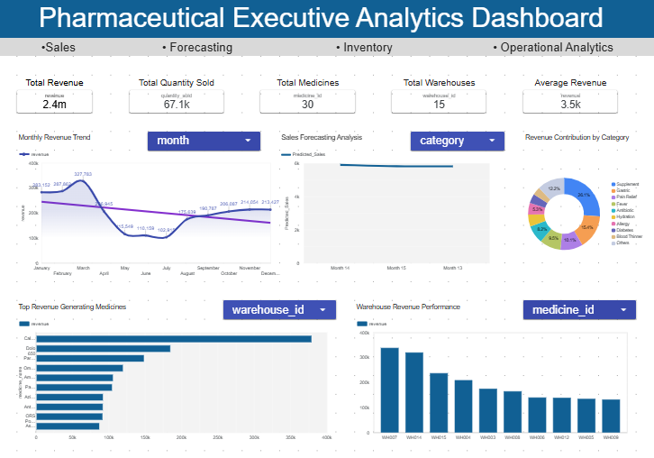
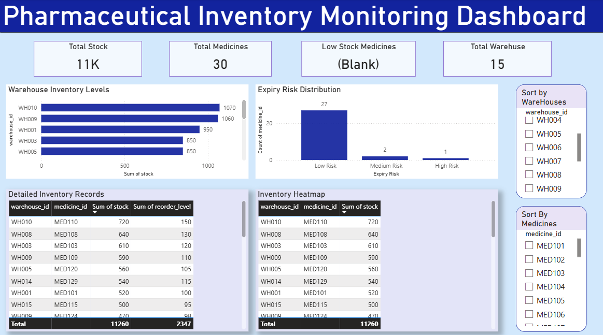
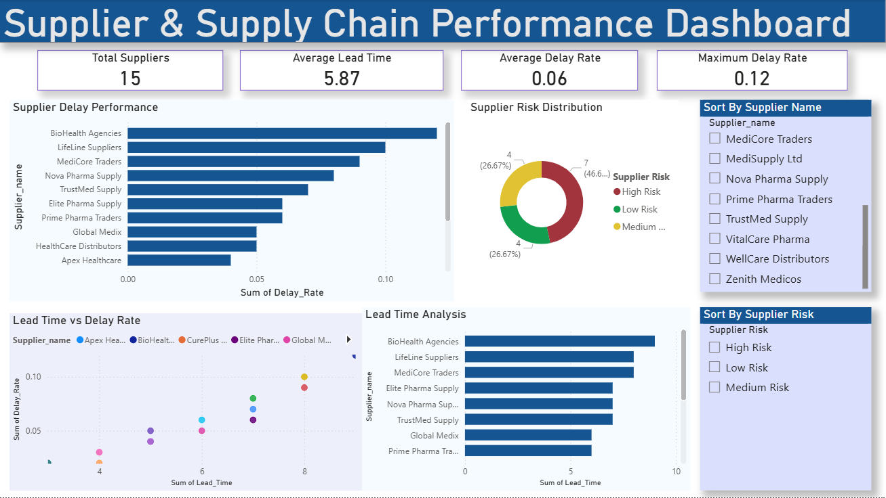

# 💊 PharmaVision 360

## End-to-End Pharmaceutical Analytics Using Descriptive, Diagnostic, Predictive & Prescriptive Intelligence

---

# 📌 Project Overview

PharmaVision 360 is a complete end-to-end pharmaceutical analytics project developed using **Python, SQL, Power BI, and Looker Studio** to analyze pharmaceutical sales, inventory operations, warehouse performance, supplier efficiency, and future demand trends.

The project transforms raw pharmaceutical operational data into actionable business intelligence through:

* Descriptive Analytics
* Diagnostic Analytics
* Predictive Analytics
* Prescriptive Analytics

This project simulates a real-world pharmaceutical business environment and demonstrates how data analytics can optimize operational efficiency, supply chain management, and strategic decision-making.

---

# 🎯 Business Problem Statement

Pharmaceutical companies often face challenges such as fluctuating demand, inventory shortages, supplier delays, expiry risks, and inconsistent revenue performance, leading to operational inefficiencies and supply chain disruptions.

This project develops an end-to-end Pharmaceutical Analytics Framework using Python, SQL, and Power BI to analyze sales, monitor inventory and supplier performance, forecast future demand, and generate data-driven business recommendations through Descriptive, Diagnostic, Predictive, and Prescriptive Analytics.

---

# 🚀 Project Objectives

* Analyze pharmaceutical sales performance
* Monitor inventory and expiry risks
* Evaluate warehouse operational efficiency
* Assess supplier lead time and delay performance
* Detect sales anomalies and operational risks
* Forecast future pharmaceutical demand trends
* Build interactive business intelligence dashboards
* Generate actionable business recommendations

---

# 🛠️ Tools & Technologies Used

| Tool / Technology | Purpose                            |
| ----------------- | ---------------------------------- |
| Python            | Data Cleaning & Analysis           |
| Pandas            | Data Manipulation                  |
| NumPy             | Numerical Operations               |
| Matplotlib        | Data Visualization                 |
| Statsmodels       | Statistical Analysis & Forecasting |
| MySQL             | Database Management                |
| SQL               | Business Query Analysis            |
| Power BI          | Dashboard Development              |
| Looker Studio     | Interactive Visualization          |
| Jupyter Notebook  | Development Environment            |

---

# 📂 Datasets Used

The project includes multiple pharmaceutical business datasets:

### 1. Sales Dataset

* Revenue
* Quantity Sold
* Medicine ID
* Warehouse ID
* Date
* Country

### 2. Medicines Dataset

* Medicine Name
* Category
* Manufacturer
* Unit Price

### 3. Inventory Dataset

* Stock Levels
* Expiry Date
* Reorder Level
* Stock Status
* Expiry Risk

### 4. Supplier Dataset

* Supplier Name
* Lead Time
* Delay Rate

### 5. Warehouse Dataset

* Warehouse Information
* Regional Distribution

---

# 🔄 Project Workflow

```text
Data Collection
        ↓
Data Cleaning & Transformation (Python)
        ↓
Feature Engineering & EDA
        ↓
SQL Database Integration
        ↓
Statistical & Forecast Analysis
        ↓
Business Intelligence Dashboarding
        ↓
Business Insights & Recommendations
```

---

# 📊 Analytics Performed

## 🔹 Descriptive Analytics

* Monthly Revenue Analysis
* Top Medicines by Revenue
* Warehouse Revenue Analysis
* Inventory & Expiry Risk Analysis
* Supplier Performance Analysis

---

## 🔹 Diagnostic Analytics

* Revenue Decline Analysis
* Supplier Delay Impact
* Inventory Risk Investigation
* Warehouse Performance Diagnosis
* Sales Anomaly Detection

---

## 🔹 Predictive Analytics

* Demand Forecasting
* Revenue Trend Prediction
* Moving Average Analysis
* ARIMA Forecasting
* Seasonality Analysis

---

## 🔹 Prescriptive Analytics

* Inventory Optimization Recommendations
* Supplier Improvement Strategies
* Warehouse Allocation Optimization
* Demand-Based Stock Planning
* Operational Risk Mitigation

---

# 📈 Statistical Analysis

The project includes advanced statistical analysis using Python and Statsmodels:

* Trend Decomposition
* Seasonality Analysis
* Correlation Analysis
* Moving Average Analysis
* Revenue Growth Analysis
* Forecasting Models

---

# 📊 Dashboards Developed

## 📌 Executive Sales Dashboard

* Revenue KPIs
* Sales Trends
* Top Medicines
* Country-wise Performance

---

## 📌 Inventory Monitoring Dashboard

* Stock Status
* Expiry Risk Analysis
* Warehouse Inventory Distribution
* Reorder Monitoring

---

## 📌 Supplier Performance Dashboard

* Lead Time Analysis
* Delay Rate Monitoring
* Supplier Efficiency Evaluation

---

# 🔍 Key Insights

* Strong positive correlation between Quantity Sold and Revenue
* Significant seasonal demand patterns identified
* High dependency on top-performing medicines
* Uneven warehouse revenue contribution observed
* Supplier lead time variation impacts inventory continuity
* Stable inventory health with low expiry risk
* Forecasting indicates future demand stabilization

---

# 💡 Business Recommendations

* Implement predictive inventory planning
* Improve supplier performance monitoring
* Optimize warehouse inventory allocation
* Use forecasting for proactive decision-making
* Reduce dependency on limited high-performing medicines
* Strengthen operational risk monitoring systems

---

# 📌 Project Outcome

This project successfully demonstrates how data analytics can improve:

* pharmaceutical operational efficiency,
* inventory management,
* supplier coordination,
* demand forecasting,
* and business decision-making.

The solution integrates analytics, forecasting, SQL querying, and dashboarding into a unified pharmaceutical intelligence framework.

---

# 🧠 Skills Demonstrated

* Data Analysis
* Data Cleaning & Transformation
* SQL Querying
* Statistical Analysis
* Forecasting & Time-Series Analysis
* Dashboard Development
* Business Intelligence
* Data Visualization
* Supply Chain Analytics
* Pharmaceutical Domain Analytics

---

# 📷 Project Snapshots


## Executive Sales Dashboard


---

## Inventory Monitoring Dashboard


---

## Supplier Performance Dashboard


---

# 📬 Author

## Amarsa Banerjee

Aspiring Data Analyst

### Tech Stack:

Python | SQL | Power BI | Excel | Data Analytics | Business Intelligence

---

# ⭐ If you found this project useful, feel free to star the repository!
